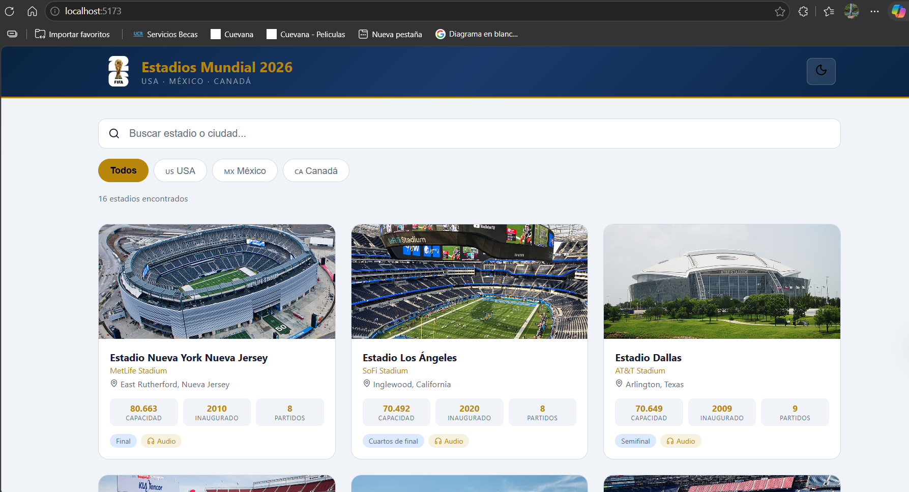
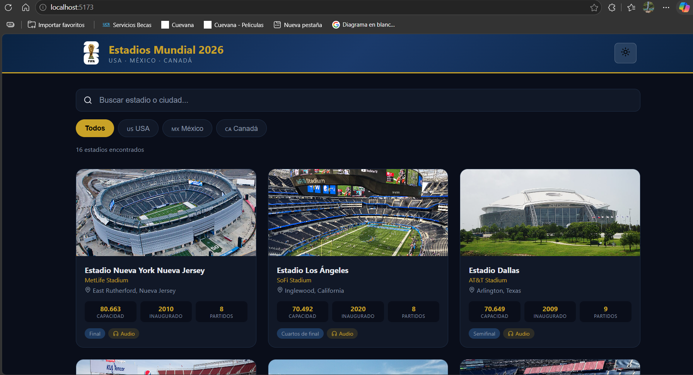
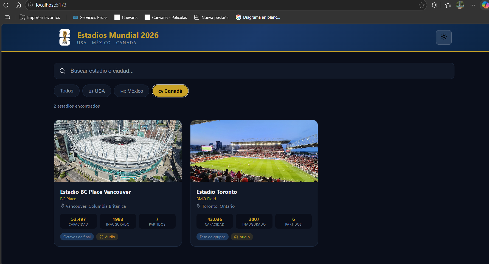
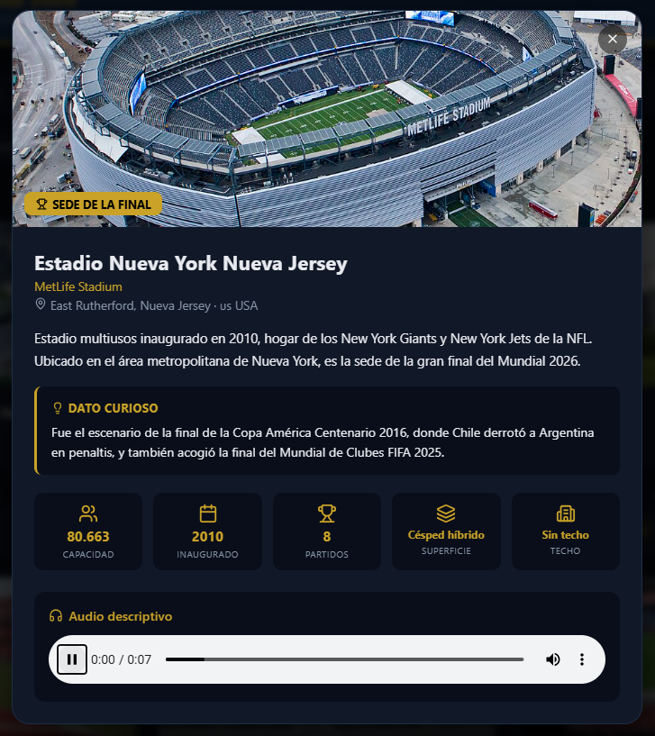
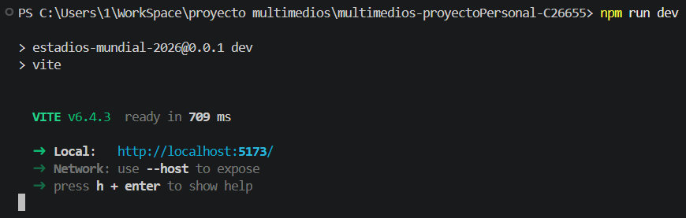
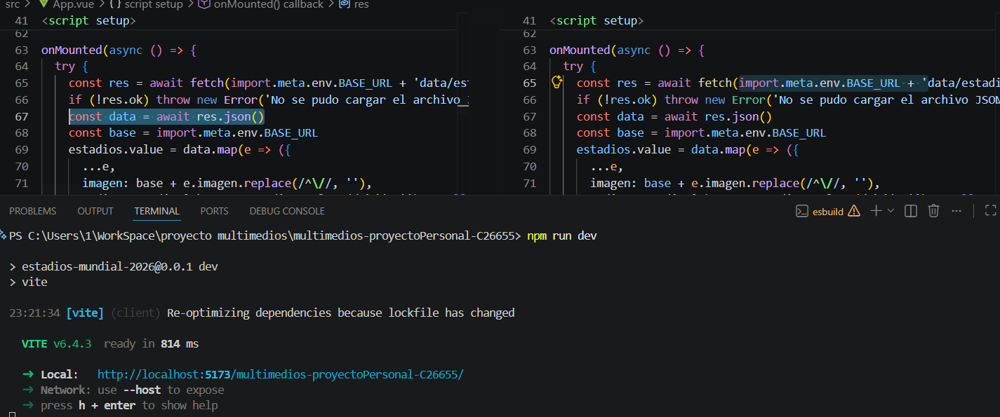

# Estadios del Mundial 2026

Enciclopedia interactiva de los 16 estadios oficiales de la Copa Mundial de Fútbol FIFA 2026, celebrada en Estados Unidos, México y Canadá.

**Estudiante:** Michelle Dayana Rodríguez Oviedo  
**Carné:** C26655  
**Curso:** IF7102 Multimedios

---

## Descripción

Aplicación web desarrollada con Vue 3 que permite explorar información detallada de cada estadio sede del Mundial 2026: capacidad, año de inauguración, superficie, tipo de techo, descripción y un dato curioso. Incluye filtros por país, búsqueda por nombre o ciudad, modo oscuro/claro y audio descriptivo para cada estadio.

## Tecnologías utilizadas

- **Vue 3** con Composition API (`<script setup>`)
- **Vite** como herramienta de construcción
- **CSS Variables** para el sistema de temas (oscuro/claro)
- **Lucide Vue** para íconos SVG
- **Fetch API** para carga dinámica de datos JSON

## Cómo ejecutar el proyecto

```bash
npm install

npm run dev
```

O bien, ingresar al link de Pages

## Capturas de pantalla


*Screenshot de cómo se ve en modo calro*


*Screenshot de cómo se ve en modo oscuro*


*Screenshot de cómo se ve la filtración por paises*


*Screenshot de cómo se ve el detalle de cada estadio*


*Screenshot de demostración de uso de npm run dev*


*Screenshot de cómo se ve el link luego de realizar cambios para que se muestren los datos en pages, se usó la propiedad base de Vite y import.meta.env.BASE_URL para que las rutas se ajusten automáticamente según el entorno*